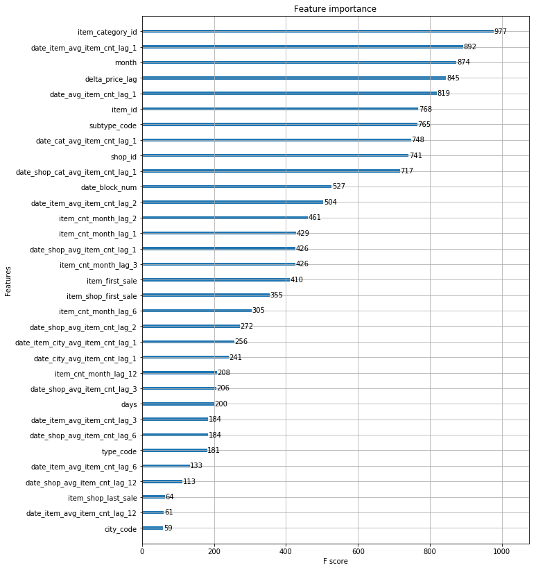

# Data-Science-HW3
我在開始之前發現到這次的作業可能電腦每跑一次要跑很久，因此先去查了GPU加速的方法，因為這次作業要用到scikit-learn，因此從這方向下去，找很可惜找到的結果[Will scikit-learn utilize GPU?](https://stackoverflow.com/questions/41567895/will-scikit-learn-utilize-gpu)scikit-learn無法用GPU加速。
之後查到XGBRegressor有個nthread的參數可以讓更多thread下去跑，達到加速的效果。


## 第一次
照抄[Feature engineering, xgboost](https://www.kaggle.com/dhimananubhav/feature-engineering-xgboost)可是只得到0.91187

## 第二三四次
照著最後印出的feature importance，嘗試看看減少不重要的特徵，看看是否能加速以及更準確

結果分數反而更低
二：0.91732
三：0.91785
四：0.91445

## Feature Selection
之後我嘗試看看[Feature Selection](https://machinelearningmastery.com/feature-importance-and-feature-selection-with-xgboost-in-python/)的方式
```
Y_pred = model.predict(X_valid).clip(0, 20)
Y_test = model.predict(X_test).clip(0, 20)
predictions = [round(value) for value in Y_pred]
accuracy = accuracy_score(Y_valid, predictions)
print("Accuracy: %.2f%%" % (accuracy * 100.0))
thresholds = sort(model.feature_importances_)
for thresh in thresholds:
  print("Thresh=%.3f start select" % (thresh))
  selection = SelectFromModel(model, threshold=thresh, prefit=True)
  select_X_train = selection.transform(X_train)
  selection_model = XGBClassifier()
  print("start fit")
  selection_model.fit(select_X_train, Y_train)
  print("start predit")
  select_X_valid = selection.transform(X_valid)
  select_X_test = selection.transform(X_test)
  Y_pred = selection_model.predict(select_X_valid).clip(0, 20)
  Y_test = selection_model.predict(select_X_test).clip(0, 20)
  predictions = [round(value) for value in Y_pred]
  accuracy = accuracy_score(Y_valid, predictions)
  print("Thresh=%.3f, n=%d, Accuracy: %.2f%%" % (thresh, select_X_train.shape[1], accuracy*100.0))
```
然而電腦跑了4個小時連一個結果都沒有，因此放棄。

## 第五、七次
第五、七次單純增加XGBRegressor的max_depth和n_estimators，結果0.91163比第一次原本的好了0.00024

## 第六次
第六次因為我想說為什麼我照抄反而比原本的低分，因此將[Feature engineering, xgboost](https://www.kaggle.com/dhimananubhav/feature-engineering-xgboost)上的submisson直接下載下來丟上去看看，想不到也是比0.90646還要差的0.90684分，但是比我抄過去的執行上還來的好，因此推測會發生這個問題應該是sales_train是V2的關係

